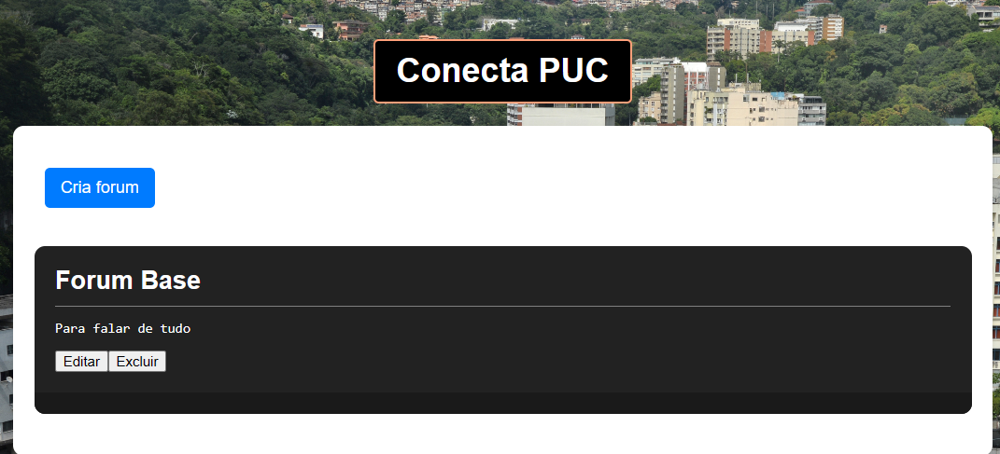

# INF1407-Projeto-1
Projeto 2 da matéria Programação para Web da PUC-Rio. O projeto tem como objetivo implementar um sistema de fóruns online com frontend e backend separados.

## Desenvolvedores

Caio Coutinho - 1921044
Paulo Vianna - 2020704

## Escopo do Site:

Desenvolvemos um site que permite, ao usuário comum, realizar a publicação em fóruns, comentar em posts e deletar e editar seus próprios comentários e posts, e aos administradores, criar fóruns, deletar posts e comentários de qualquer pessoa.

## O que implementamos

 - Telas de login, esqueci minha senha, fóruns, publicação em fórum, comentário, páginas específicas para cada fórum.
 - Visões diferentes para usuário comum e administrador 
 - Capacidade do usuário para criar fóruns, criar publicação, comentar, editar e deletar comentários e publicações feitas pelo próprio.
 - Capacidade de Administrador de deletar publicações e comentários de outros usuários, além de todas as permissões do usuário comum

 ## O que deixamos de implementar

 - Proteção do Endpoint
 - Registro de usuário

 # Guia de usuário

 - Primeiramente, clique para fazer login
 
 
 
 - Você será transferido para a aba de fóruns, clique em "Criar fórum" ou clique no título do fórum que deseja acessar.

 

 - Clique em criar publicação, adicione um título e um conteúdo, e depois aperte o botão para publicar

 

 - Alternativamente, também pode clicar em comentar na publicação de outras pessoas, ou na sua própria.

 - Qualquer publicação ou comentário feito por você pode ser deletado ou editado a qualquer momento.

